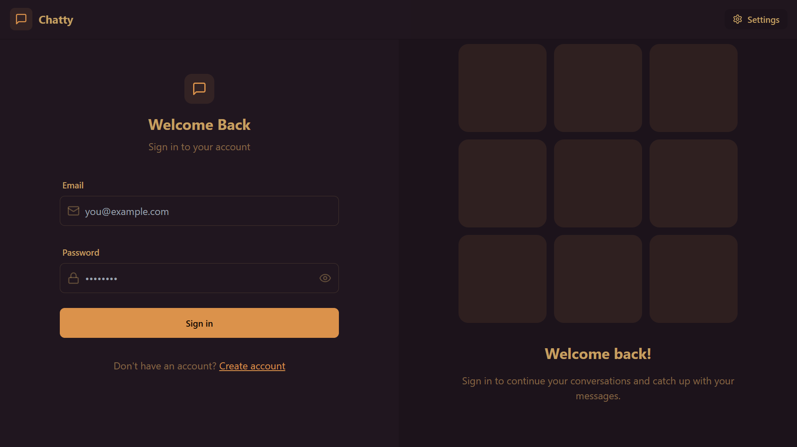
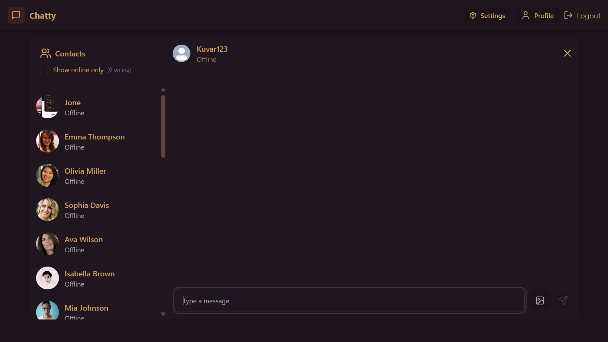
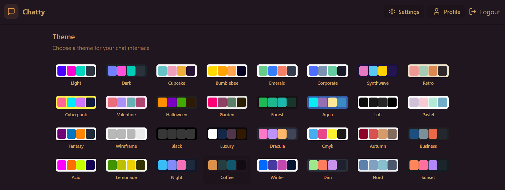

# Real Chat Application

## Overview
A real-time chat application built with modern web technologies, providing instant messaging, user authentication, and a responsive UI.

## Features
- Real-time messaging
- User authentication (Sign up, Login, Logout)
- Online/offline status indicators
- Group and private chats
- Message notifications
- Media sharing (images, files)
- Responsive UI for mobile and desktop

## Tech Stack
- **Frontend**: ReactJS, Redux, Tailwind CSS
- **Backend**: Node.js, Express.js
- **Database**: MongoDB
- **Authentication**: Firebase Auth / JWT
- **Real-time Communication**: Socket.io
- **Hosting**: Vercel / Firebase / AWS

## Installation

### Prerequisites
Ensure you have the following installed:
- Node.js
- MongoDB (or use a cloud service like MongoDB Atlas)

### Steps
1. Clone the repository:
   ```bash
   git clone https://github.com/yourusername/real-chat-app.git
   cd real-chat-app
   ```
2. Install dependencies:
   ```bash
   npm install
   ```
3. Set up environment variables in a `.env` file:
   ```env
   MONGO_URI=your_mongodb_connection_string
   JWT_SECRET=your_jwt_secret
   SOCKET_PORT=your_socket_port
   ```
4. Start the backend server:
   ```bash
   npm run server
   ```
5. Start the frontend:
   ```bash
   npm run client
   ```

## Screenshots
### Login Page



### Home Page


### Theme Page


## Usage
- Sign up or log in to start chatting.
- Create chat groups or send direct messages.
- Share media and enjoy real-time updates.

## Contributing
Feel free to fork and contribute! Submit a pull request with your changes.

## License
MIT License

## Contact
For any queries, reach out to me at [your-email@example.com](mailto:your-email@example.com).
